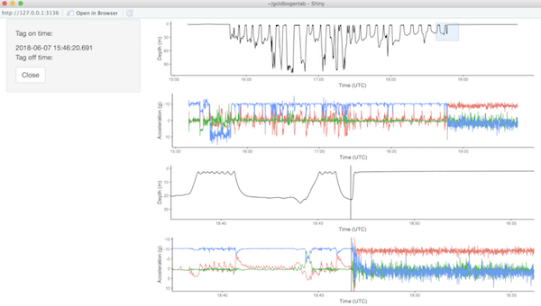

```{r setup, include = FALSE}
devtools::load_all(".")
library(tidyverse)
library(lubridate)
knitr::opts_chunk$set(
  collapse = TRUE,
  comment = "#>",
  cache = TRUE,
  cache.lazy = FALSE
)
```

Creating a pitch-roll-heading (PRH) file is a delicate process, dependent on device- and deployment-specific properties. The `goldbogenlab` package provides a set of (hopefully) useful tools to facilitate PRH creation. We begin by importing and cleaning raw data. This vignette will walk you through some common operations in PRH initialization.

We will use deployment _mn180607-44_ as an example because it contains some common errors in the data. Please note that using the `goldbogenlab` package requires:

1. Your COPYCATS drive is available
2. The config file knows the path to the COPYCATS drive (see [set_cats_path()])

## Reading Raw Data

If your config file is properly set up, then all you need to provide are the `tagid` (i.e. _mn180607-44_) and `tagnum` (i.e. _44_). Make sure you have memory available beause the raw data will probably be _huge_ (several GB). It'll probably take a few minutes. You should see a progress bar and a warning that the timestamps are out of order.

```{r read_raw}
raw_prh <- init_prh("mn180607-44", "44")
```

It may seem redundant to supply both `tagid` and `tagnum`, but the latter isn't always the last numbers of the former (e.g. _bp180525-44b_). `init_prh` will look for the `tagid` in the _tag\_data\_raw_ folder and load the raw CSVs. Your data should look like:

```{r}
head(raw_prh@rawdata)
```

## Backskips

Deployment _mn180607-44_ has a couple errors, including backskips and gaps. A backskip is when the timestamps skip forward and then backwards. Here's an example:

```{r}
# Find backskips
timestamps <- raw_prh@rawdata$datetimeUTC
backskips <- which(lead(timestamps) < timestamps)
backskips

# Find the boundaries around the first backskip
foreskips <- which(difftime(lead(timestamps), timestamps, units = "secs") > 1)
gap_begin <- timestamps[foreskips[1]]
backskip_begin <- timestamps[foreskips[1] + 1]
backskip_end <- timestamps[backskips[1]]
gap_end <- timestamps[backskips[1] + 1]
  
raw_prh@rawdata %>%
  mutate(timestamp_order = seq_along(datetimeUTC)) %>%
  filter(between(datetimeUTC, 
                 gap_begin - seconds(0.5), 
                 gap_end + seconds(1.5))) %>%
  ggplot(aes(timestamp_order, datetimeUTC)) +
  geom_point() +
  annotate("rect", 
           xmin = foreskips[1], xmax = backskips[1] + 1, 
           ymin = gap_begin, ymax = gap_end, 
           fill = "red", alpha = 0.5) +
  annotate("rect", 
           xmin = foreskips[1] + 1, xmax = backskips[1], 
           ymin = backskip_begin, ymax = backskip_end, 
           fill = "blue", alpha = 0.5) +
  scale_y_datetime(date_labels = "%H:%M:%OS1") +
  labs(x = "Timestamp Order",
       y = "Timestamp") +
  theme_classic()
```

Notice the timestamps recorded in the backskip (blue box) are duplicated later in the time series. Also, the duration of the timeskip is shorter than the gap around it (red box). That suggests we can't trust the data in the timeskip or fix it by shifting the timestamps down. So we'll delete those records and add new timestamps in the correct order using `fix_backskip`.

```{r}
fixbackskip_prh <- fix_backskip(raw_prh)
timestamps <- fixbackskip_prh@rawdata$datetimeUTC
new_gap_end <- which(timestamps == gap_end)
fixbackskip_prh@rawdata %>%
  mutate(timestamp_order = seq_along(datetimeUTC)) %>%
  filter(between(datetimeUTC, 
                 gap_begin - seconds(0.5), 
                 gap_end + seconds(1.5))) %>%
  ggplot(aes(timestamp_order, datetimeUTC)) +
  geom_point() +
  annotate("rect", 
           xmin = foreskips[1], xmax = new_gap_end, 
           ymin = gap_begin, ymax = gap_end, 
           fill = "red", alpha = 0.5) +
  scale_y_datetime(date_labels = "%H:%M:%OS1") +
  labs(x = "Timestamp Order",
       y = "Timestamp") +
  theme_classic()
```

Now the timestamps are in proper order and evenly distributed. Note the red box is much wider now due to filling in missing timestamps. There was also a warning with the number of backskips and the longest duration. If the longest duration backskip exceeds a threshold (by default 2s) then manual data processing will be necessary. 

## Gaps

Gaps are more straightforward than backskips. After you smooth over the backskips, there may still be forward gaps, as seen here.

```{r}
# Remove raw_prh to open up some memory
rm(raw_prh)

# Find gaps greater than 0.1s
timestamps <- fixbackskip_prh@rawdata$datetimeUTC
gaps <- which(as.numeric(lead(timestamps) - timestamps, units = "secs") > 0.1)
gaps

# Find the boundaries around the first gap
gap_begin <- timestamps[gaps[1]]
gap_end <- timestamps[gaps[1] + 1]

fixbackskip_prh@rawdata %>%
  mutate(timestamp_order = seq_along(datetimeUTC)) %>%
  filter(between(datetimeUTC, 
                 gap_begin - seconds(0.5), 
                 gap_end + seconds(1.5))) %>%
  ggplot(aes(timestamp_order, datetimeUTC)) +
  geom_point() +
  scale_y_datetime(date_labels = "%H:%M:%OS1") +
  labs(x = "Timestamp Order",
       y = "Timestamp") +
  theme_classic()
```

If gaps are less than a duration threshold (by default 2s) then we can use `fix_gap` to fill in the timestamps, similarly as `fix_backskip`.
```{r}
fixgap_prh <- fix_gap(fixbackskip_prh)

fixgap_prh@rawdata %>%
  mutate(timestamp_order = seq_along(datetimeUTC)) %>%
  filter(between(datetimeUTC, 
                 gap_begin - seconds(0.5), 
                 gap_end + seconds(1.5))) %>%
  ggplot(aes(timestamp_order, datetimeUTC)) +
  geom_point() +
  scale_y_datetime(date_labels = "%H:%M:%OS1") +
  labs(x = "Timestamp Order",
       y = "Timestamp") +
  theme_classic()
```

Once again we see a warning about the longest gap found and the timestamps are evenly in order. Note: backskips must be fixed first, before gaps, or you'll get an error.

## Decimation and Trimming

The raw data files are sampled at high frequency and are enormous. After fixing backskips and gaps, we will want to decimate the file to a more manageable size (typically 10 Hz). We can use `decimate_prh` to do that. If we try decimating a file with backskips or gaps, `decimate_prh` will throw an error.

```{r}
# Remove fixbackskip_prh to open up some memory
rm(fixbackskip_prh)

# How big is the raw data?
object.size(fixgap_prh)

# Decimate data
deci_prh <- decimate_prh(fixgap_prh, new_freq = 10)

# How big is the decimated data?
object.size(deci_prh)
```

Decimation reduced the file size by about two orders of magnitude, from ~2.4 GB to ~60 MB. Next we need to trim the data to the deployment. The `trim_data` function provides a GUI for helping you identify the tag on/off times.



The GUI shows both the depth and acceleration profiles. You can brush the top plots (click and drag) to zoom in on the bottom plots. Hovering on one of the zoom plots will bring up a vertical line indicator. Single-click on a zoom plot to set the tag on time and double-click to set the tag off time. Click Close to return the values.

Alternatively, if you know the tag on and off times, you can supply them directly to `trim_data`.

```{r}
# Remove fixgap_prh to open up some memory
rm(fixgap_prh)

# Set the tag on/off times
on <- as.POSIXct("2018-06-07 15:46:18", tz = "UTC")
off <- as.POSIXct("2018-06-07 18:46:38", tz = "UTC")
trim_prh <- trim_data(deci_prh, use_gui = FALSE, tagon = on, tagoff = off)
```

## Interpolation

The last step of PRH intiation, before you begin calibration, is to interpolate any missing sensor records. These may be caused by a glitch in the sensor itself or introduced by `fix_backskip` or `fix_gap`. If they're not to long (2s by default), you can linearly interpolate the values using `interp_gaps`.

```{r}
# Remove deci_prh
rm(deci_prh)

# Where are the gaps in sensor readings?
# See rle help for details on run length encoding
sensor_gaps <- rle(is.na(trim_prh@rawdata$accX))
sensor_gaps
# The second gap (15 records) is the longest, beginning at index 2086
gap_start_ix <- 2086
gap_end_ix <- 2086 + 15
gap_start <- trim_prh@rawdata$datetimeUTC[gap_start_ix]
gap_end <- trim_prh@rawdata$datetimeUTC[gap_end_ix]

# Plot gap
filter(trim_prh@rawdata,
       between(datetimeUTC, gap_start - seconds(2), gap_end + seconds(2))) %>%
  ggplot(aes(datetimeUTC, accX)) + 
  geom_point() +
  scale_x_datetime(date_labels = "%H:%M:%OS1") +
  labs(x = "Timestamp",
       y = "accX") +
  theme_classic()

# Interpolate gaps
prh <- interp_gaps(trim_prh)

# Plot gap after interpolation
filter(prh@rawdata,
       between(datetimeUTC, gap_start - seconds(2), gap_end + seconds(2))) %>%
  ggplot(aes(datetimeUTC, accX)) + 
  geom_point() +
  scale_x_datetime(date_labels = "%H:%M:%OS1") +
  labs(x = "Timestamp",
       y = "accX") +
  theme_classic()
```

## Summary and Next Steps

To initialize a PRH, we loaded the raw data and cleaned, decimated, trimmed, and interpolated it. We used the following functions:

- `init_prh`
- `fix_backskip`
- `fix_gap`
- `decimate_prh`
- `trim_data`
- `interp_gaps`

The data is now in a reliable state. The next step is to calibrate the data to get the most accurate readings.
